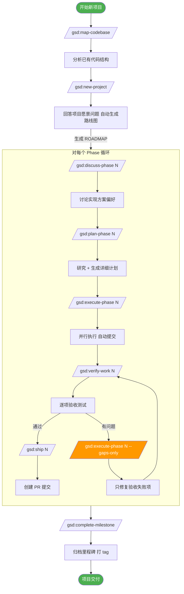
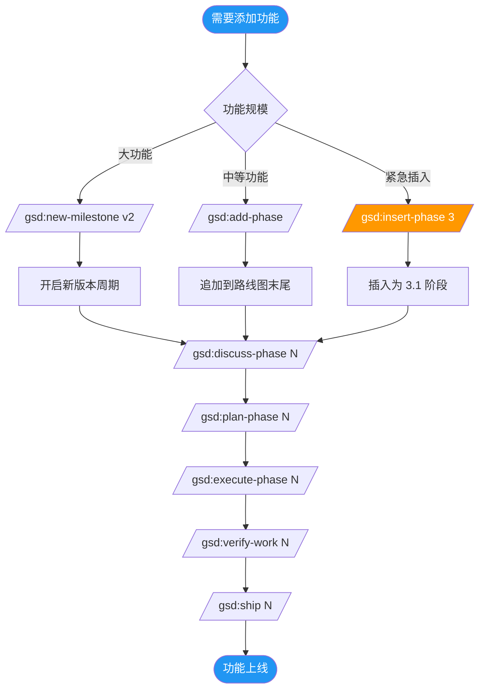
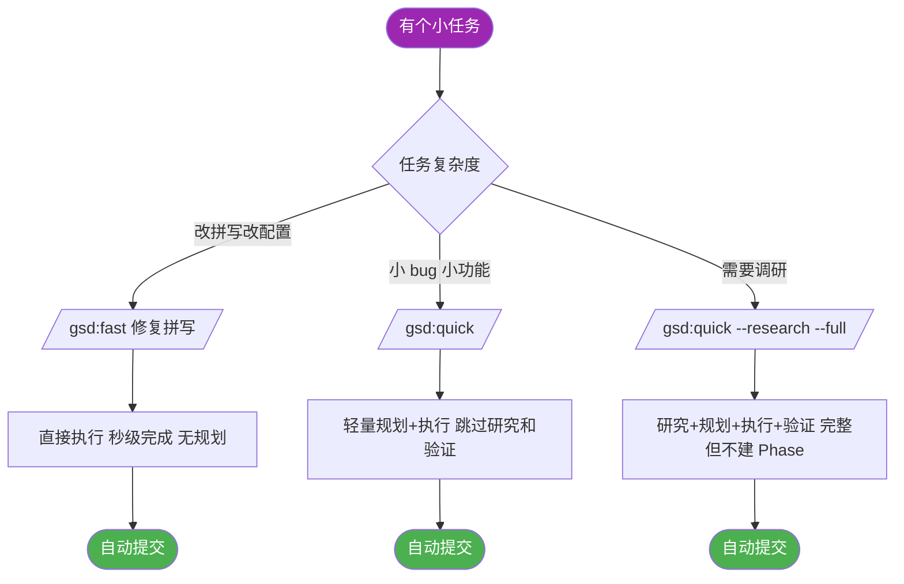
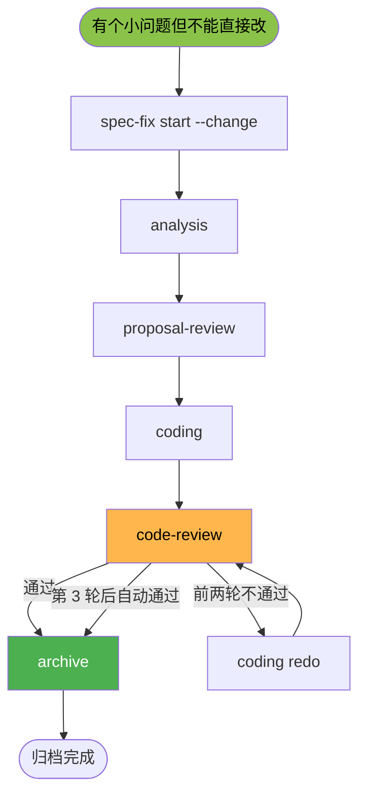
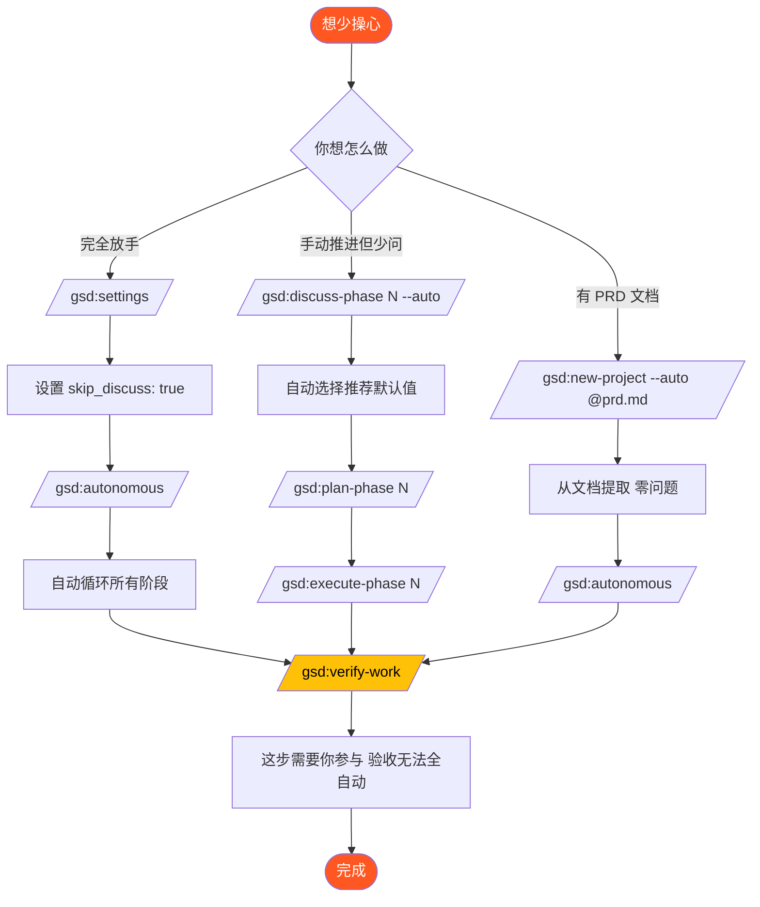
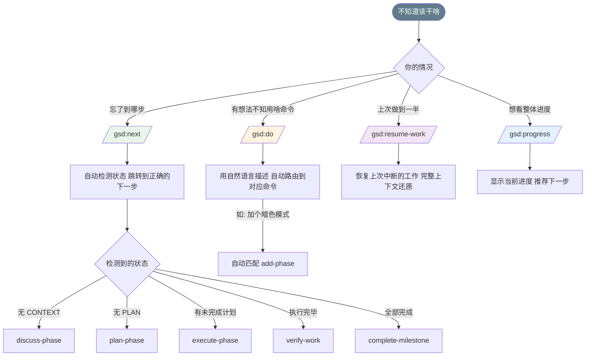
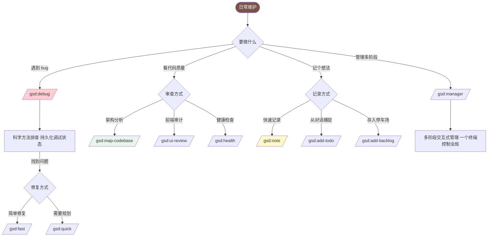
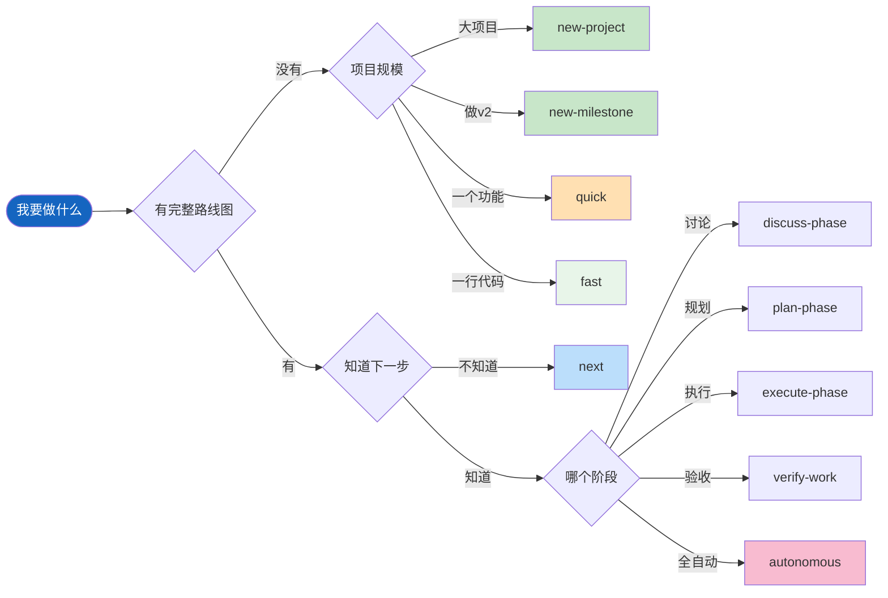

# GSD 使用流程图

## 场景一：全新项目完整流程

从零开始一个新项目，走完整的规划→执行→交付流程。

## 场景二：已有项目添加新功能

项目已经在运行，需要加一个新功能或修复一个较大的 bug。

## 场景三：小任务快速修复

不想走完整的 Phase 流程，只是改个 bug 或做个小调整。

### 需要固定审查闸门的小修复

当问题不大，但又必须保留证据、提案审查、代码回看和归档记录时，走固定的 `spec-fix` runner。

职责边界：
- `.planning/fixes/<id>/` 保存这一次 fix run 的运行态、阶段工件和 mux 元数据
- `.planning/openspec/` 保存对应 OpenSpec change 的 proposal、design、specs、tasks 与 archive 历史
- `spec-fix` 负责推进 workflow，OpenSpec 负责声明态工件与 change 生命周期
- archive 阶段只有在关联 OpenSpec change 先成功归档后才会把 workflow 标记为 `archived`

## 场景四：全自动少问模式

不想被问问题，让 AI 自己决定一切。

## 场景五：不知道下一步干什么

迷路了？不确定项目推进到哪了？

## 场景六：调试与日常维护

遇到 bug 或需要维护项目时的快捷路径。

## 速查：命令选择决策树

